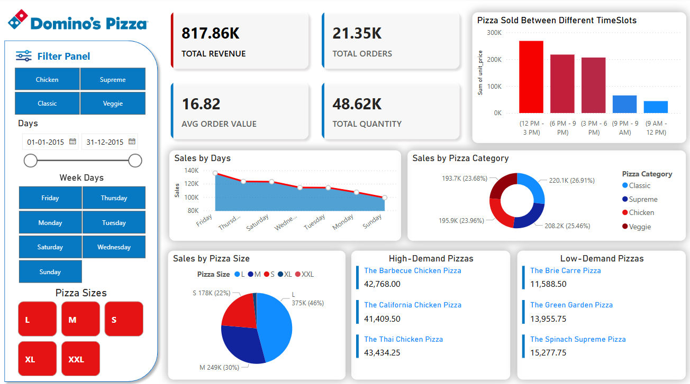

# 🍕 Domino's Sales Analysis - Power BI Dashboard

## 📌 Overview
This Power BI dashboard provides a **comprehensive sales analysis** for Domino’s Pizza, offering insights into total revenue, order trends, pizza category performance, and high-demand time slots. 

The goal is to **analyze sales performance** and **identify trends** to enhance business decision-making.

---

## 🔥 Key Features
✅ **Total Revenue & Orders**: Track overall sales and order volume.  
✅ **Time-Based Analysis**: Identify peak sales hours and best-selling days.  
✅ **Sales by Category & Size**: Compare performance of different pizza categories and sizes.  
✅ **High-Demand vs Low-Demand Pizzas**: Find out the most and least popular pizzas.  
✅ **Filter Panel**: Users can filter sales by day, pizza type, and size.

---

## 📊 Data & Metrics
The dataset includes the following key columns:

- **Order Date** 🗓️  
- **Total Sales** 💰  
- **Total Orders** 📦  
- **Pizza Category (Classic, Supreme, etc.)** 🍕  
- **Pizza Size (S, M, L, XL, XXL)** 📏  
- **Sales by Time Slot (Peak vs Non-Peak hours)** ⏳  

---

## 🖥️ Visualizations in the Dashboard
1. **KPI Cards**: Display total revenue, total orders, and average order value.  
2. **Line Chart**: Sales trends over different days of the week.  
3. **Pie Charts**: Sales breakdown by pizza category and size.  
4. **Bar Chart**: Sales by different time slots.  
5. **Table View**: High-demand and low-demand pizzas.  

---

## 📂 How to Use This Project
1. **Clone the Repository**  
   ```sh
   git clone https://github.com/sejal-rajput/Dominos-Sales-Analysis.git
2. Open Power BI Desktop
3. Load the .pbix File (Dominos_Sales_Analysis.pbix)
4. Explore & Interact with the filters and visualizations

📸 Screenshot of the Dashboard


🚀 Future Enhancements
Adding predictive analytics to forecast future sales.
Integrating customer feedback analysis to understand preferences.
Automating data refresh for real-time insights.

📢 Disclaimer
This dashboard is created solely for learning and visualization purposes. The data used is for demonstration and does not reflect actual Domino's sales figures.

Feel free to fork this repo and contribute! 🚀
💬 For any queries, reach out to me on LinkedIn.
https://www.linkedin.com/in/sejal-rajput/
